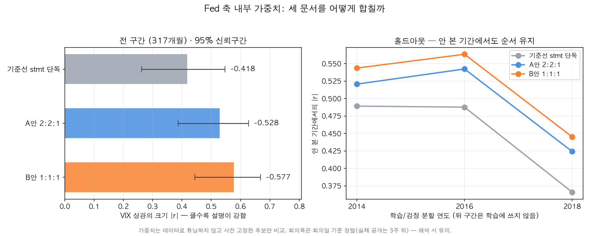

# 통합 가중치 설계 — ① News:Fed = 1:1 · ② Fed 내부 statement:presser:minutes

> 통합(headline) 지수의 두 층위 가중치를 각각 정당화한다.
> ① News 축 : Fed 축 = **1:1** (기존 검증 재정리) · ② Fed 축 내부 세 성분 = **1:1:1** (신규 검증).
> 코드: `analysis/validate_fed_weights.py` (②) · `analysis/validate_robustness.py` (①).

## ① News : Fed = 1:1 의 근거

### 1. 데이터가 직접 지지 (docs/news_fed_index.md §3)

2000–2021, 256개월 전체 재현에서 z-표준화 후 결합의 VIX 상관:

| 가중 | VIX 상관 |
|---|---|
| Fed 단독 | -0.436 |
| News 단독 | -0.386 |
| **균등 50:50** | **-0.534** ★ |
| Fed 70% | -0.519 |
| News 70% | -0.494 |

균등이 실측 최선이고, 시간분할 홀드아웃(-0.48~-0.53으로 일반화) · 블록 부트스트랩
(95% CI 0 미포함) · LOMO(단일 사건 비의존)까지 통과 (§3b).

### 2. 이론: 거의 독립인 두 신호는 균등가중이 정석

News↔Fed 상관 **+0.19** (약함) → 서로 다른 정보를 담은 거의 독립적인 두 신호.
상관 낮은 신호를 합칠 때 균등가중은 노이즈 상쇄(분산 감소)를 거의 최대로 얻으면서,
표본에서 추정한 "최적" 가중과 달리 과적합 위험이 없다 — 포트폴리오의 1/N 규칙
([DeMiguel et al. 2009](https://doi.org/10.1093/rfs/hhm075): naive diversification 이
표본외에서 최적화 가중을 이기는 경우가 많다)과 같은 논리.

### 3. 과최적화 방지: 가중치에 둔감하므로 단순한 값을 고정

위 표에서 70:30 으로 기울여도 -0.519/-0.494 로 차이가 작다 = 결과가 가중치 선택에
민감하지 않다. 민감하지 않다면 소수점 튜닝(데이터 스누핑)보다 **선험적으로 단순한
1:1 을 고정**하는 것이 방법론적으로 방어하기 좋다.

**한 줄 요약**: 두 축은 거의 독립(ρ=0.19)이므로 z-표준화 후 균등 결합이 이론적
정석이고, 실제로도 50:50 이 홀드아웃까지 통과하며 최고 성능(-0.534)을 냈다.

## ② Fed 내부 — statement : presser : minutes = 1:1:1

### 1. 판단 기준과 후보 (사전 고정 — 데이터 튜닝 아님)

성분별 특성:

| 기준 | statement | presser | minutes |
|---|---|---|---|
| 시장 영향(문헌) | 큼 | statement 이상 | 작고 감소 추세 |
| 적시성 | 즉시 | 30분 후 라이브 | **3주 지연** |
| 정보 고유성 | 공식 스탠스 | 실시간 뉘앙스 (성명문보다 일관되게 신중 — `presser_analysis.md`, gap -0.113, p<10⁻¹²) | 위원회 내부 이견·세부 논거 |
| 커버리지 | 2000~ 전체 | **2011-04~**, 2019 전엔 SEP 회의만 | 전체 |

문헌: [SF Fed USMPD(2025)](https://www.frbsf.org/research-and-insights/publications/working-papers/2025/12/financial-market-effects-of-fomc-communication-evidence-from-a-new-event-study-database/)
— presser 가 statement 보다 대부분 자산가격에 더 강한 효과, minutes 발표 전후엔 유의차 없음.
[Rosa(2013, NY Fed)](https://www.newyorkfed.org/research/epr/2013/0913rosa.html) — minutes 도
시장을 움직이지만 statement 대비 작고 갈수록 감소.

News:Fed 50:50 을 정당화한 방식과 동일하게, **후보를 사전 고정**한 뒤 안 본 기간에서
비교했다 (그리드 서치로 소수점 최적화 = 데이터 스누핑을 피함):

- **기준선** statement 단독 (현행 Fed 축)
- **A안 2:2:1** — 시장영향·적시성 차등 (statement·presser ≫ minutes)
- **B안 1:1:1** — 균등 1/N (①과 동일 논리)

방법: 성분별 z-표준화 → 회의 단위 가중결합(presser 없는 회의는 남은 성분끼리
재정규화 — `headline.py` 폴백과 동일 철학) → 월 그리드(step) → VIX 상관.
회의 214건(2000-02~2026-06), presser 있는 회의 91건.

### 2. 홀드아웃 + 부트스트랩 — B안(1:1:1)이 전 구간에서 승리 ★



*왼쪽 = 전 구간 상관과 95% 신뢰구간, 오른쪽 = 홀드아웃 3분할. 아래 두 표를 한 장으로 옮긴 것*
(`python3 analysis/fed_weights_figure.py`)

전체 구간(317개월) VIX 상관 + 블록 부트스트랩 95% CI (block=12, 3000회):

| 후보 | VIX 상관 | 95% CI |
|---|---|---|
| 기준선 stmt 단독 | -0.418 | [-0.547, -0.262] |
| A안 2:2:1 | -0.528 | [-0.627, -0.387] |
| **B안 1:1:1** | **-0.577** | **[-0.668, -0.444]** |

시간분할 홀드아웃 (앞=학습으로 z-파라미터 fit → 뒤=안 본 기간 검정):

| 분할 | 기준선 | A안 | **B안** |
|---|---|---|---|
| 2014 (검정 100회의) | -0.489 | -0.521 | **-0.544** |
| 2016 (검정 84회의) | -0.488 | -0.542 | **-0.563** |
| 2018 (검정 68회의) | -0.366 | -0.424 | **-0.445** |

→ (a) **세 성분 통합 자체가 statement 단독보다 뚜렷이 낫고** (-0.577 vs -0.418, CI 0 미포함),
(b) **B안이 세 분할 모두에서 A안을 이긴다** — 안 본 기간에서 일관되므로 과최적 아님.

### 3. 다중 타깃 — "VIX 과적합" 아님

월별 통합값을 VIX 수준 외 두 타깃과도 대조 (기대 부호: VIX 음, S&P 양):

| 후보 | VIX 수준 | S&P 월수익률 | Δ10y 금리 |
|---|---|---|---|
| 기준선 stmt 단독 | -0.418 | +0.059 | +0.046 |
| A안 2:2:1 | -0.528 | +0.056 | +0.136 |
| **B안 1:1:1** | **-0.577** | **+0.065** | **+0.161** |

**세 타깃 모두 B안 1위.** S&P 상관은 작지만 부호가 기대대로고, Δ10y 양(+)은
"낙관 톤 → 금리 상승"으로 경제직관에 부합 → VIX 하나에 맞춘 결과가 아니다.

### 4. 이벤트 스터디 — 일별 해상도로는 판별 불가 (차등 가중의 증거 부재)

각 성분의 톤 vs **자기 발표일** 당일 반응(statement·presser=회의일, minutes=공개일
근사 회의+21일 → 다음 거래일):

| 성분 (n) | 톤 수준: ΔVIX / S&P | Δ톤(전회의 대비): ΔVIX / S&P |
|---|---|---|
| statement (213) | +0.015 / -0.078 | +0.038 / -0.003 |
| presser (90) | +0.018 / -0.005 | -0.067 / +0.025 |
| minutes (211) | -0.004 / +0.046 | +0.078 / -0.107 |

전부 |r|<0.11, 부호도 비일관 → **어느 성분도 일별 종가 반응과 유의미한 관계 없음**.
문헌이 효과를 잡은 건 발표 전후 30분 고빈도 창(USMPD)이고, 일별 종가엔 그날의 다른
뉴스가 섞이며, 시장은 톤보다 금리 서프라이즈에 반응하기 때문으로 해석.

→ **성분별 시장영향 차등(A안)의 근거를 우리 데이터에서 확인할 수 없었다.**
차등을 정당화할 증거가 없으면 균등(1/N)이 보수적 기본값 — §2·§3 실측과도 일치.

### 5. 결론

**statement : presser : minutes = 1:1:1 채택.**
① 차등 가중의 증거 부재(§4) → 균등이 기본값, ② 실측으로도 홀드아웃 3분할 + 3타깃
전부에서 일관 최고(§2·§3), ③ ①(News:Fed 50:50)과 함께 "**모든 결합은 z-표준화 후
균등(1/N)**"이라는 단일 원칙으로 통일 — 설명 간단, 데이터 스누핑 없음.

### 6. 한계

- 홀드아웃의 월 그리드는 세 성분 모두 **회의일 기준 정렬** (레포 관례). minutes 실제
  공개는 3주 뒤라 실시간 관점에선 낙관적 정렬 — 운영 반영 시 공개일 기준으로 지연 처리.
- statement 와 presser 는 같은 날이라 일별 종가로는 두 성분의 시장영향을 분리 불가.
  이벤트 스터디의 엄밀 검증은 일중(intraday) 데이터 필요 — 향후 과제.
- presser 는 2011-04 신설 · 2019 전엔 SEP 회의만 → 없는 회의는 가중치 재정규화로 처리
  (2000년대 구간에선 사실상 statement:minutes = 1:1).
- 상관 ≠ 인과, 예측 아님 (레포 공통 한계).

## 산출물·재현

```bash
python3 analysis/validate_fed_weights.py   # ② 전체 (홀드아웃·부트스트랩·다중타깃·이벤트)
python3 analysis/fed_weights_figure.py     # ② §2 그림 → docs/figures/comparison/fed_weights.png
python3 analysis/validate_robustness.py    # ① News:Fed 50:50 견고성 (기존)
```

- 입력: `outputs/minutes_tones.csv` · `outputs/presser_tones.csv` (각 backfill 스크립트) + yfinance(^VIX·^GSPC·^TNX)
- ※ 비ASCII(한글) 경로 환경에선 yfinance 인증서 문제로 `CURL_CA_BUNDLE`·`SSL_CERT_FILE` 을
  ASCII 경로의 cacert.pem 으로 지정 필요 (`collect_market.py` 의 `_ensure_ascii_cert` 참고 —
  단, 임시폴더도 한글 경로면 무효라 예: `C:\Users\Public\cacert.pem` 권장).
